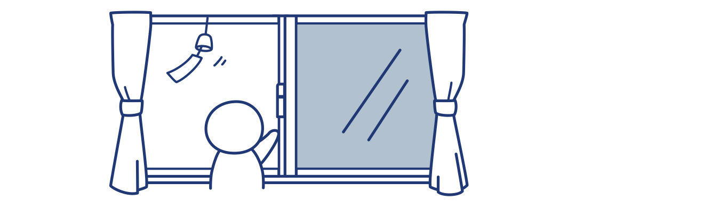
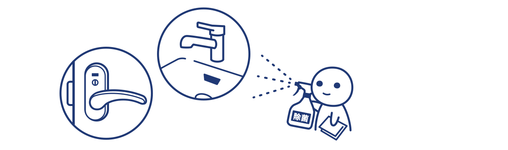

# Q
感染が疑われる人がいる場合に、自宅でどのように隔離したらよいですか？
(QA01-11)
​
# A
8つのポイントを守ります  
### （１）個室に分けて共有スペースの利用を避けます

### （２）感染者のお世話はできるだけ限られた方で行い、基礎疾患や免疫低下、妊婦の方がお世話することは避けます

### （３）マスクをつけ、ほかの部屋には持ち出さず、外した時は手洗いします

### （４）こまめに石けんで手を洗い、アルコール消毒を行います

### （５）定期的に換気します

### （６）手で触れる共有部分を消毒します

### （７）汚れたリネンや衣服を洗濯します

### （８）ゴミは密閉して捨てます

また、以下の注意点をご確認ください。  
* 本人は外出を避け、家族や同居人も健康観察のうえ不要不急の外出を避けます。特に咳や発熱などの症状があるときは、職場などに行かないでください。  
* ドアの取手、ノブ、ベッド柵などは、薄めた0.05％の塩素系漂白剤（可能ならば0.1％）で拭いた後に水拭き、もしくはアルコール消毒をしてください。（薄めた塩素系漂白剤が、誤って身体に付かないように対策してください。）  
* トイレや洗面所、お風呂は、家庭用掃除洗剤を使って清掃し、水ですすいだ後、0.1%の次亜塩素酸ナトリウムを含む家庭用洗剤を使用します。  
* タオル・食器・箸・スプーンなどを共用しません。衣類、タオル、食器・箸・スプーンなどは、通常の洗濯や洗浄を行ってください。別洗いする必要はありませんが、洗濯や洗浄前の共用は行わないでください。

# 参考文献
参考(1)：厚生労働省「新型コロナウイルスの感染が疑われる人がいる場合の家庭内での注意事項（日本環境感染学会とりまとめ）」  
https://www.mhlw.go.jp/stf/seisakunitsuite/newpage_00009.html  
  
参考(2)：世界保健機関（WHO）​「Infection Prevention and Control for the safe management of a dead body in the context of COVID-19」  
https://apps.who.int/iris/bitstream/handle/10665/331538/WHO-COVID-19-lPC_DBMgmt-2020.1-eng.pdf  
  
参考(3)：The Journal of Hospital Infection「Persistence of coronaviruses on inanimate surfaces and their inactivation with biocidal agents」G. Kampfほか  
https://www.journalofhospitalinfection.com/article/S0195-6701(20)30046-3/fulltext