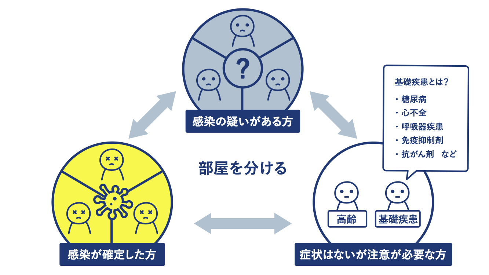
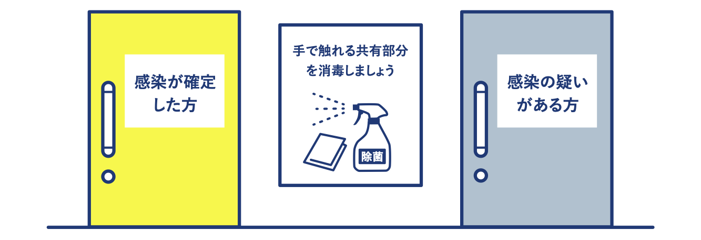
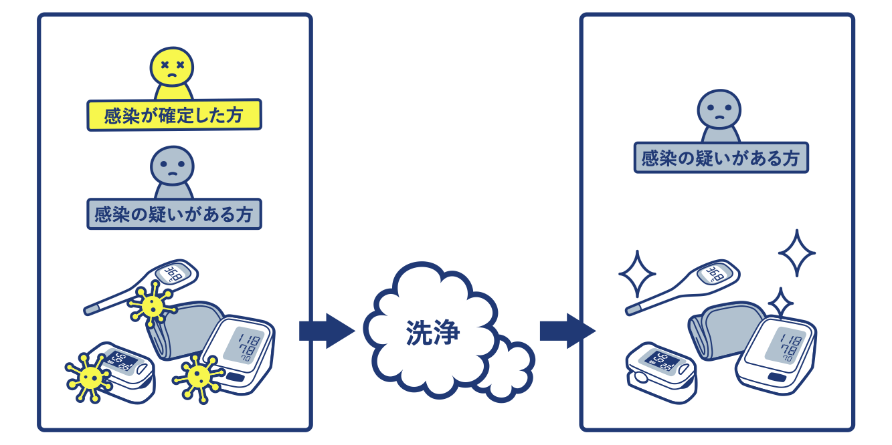
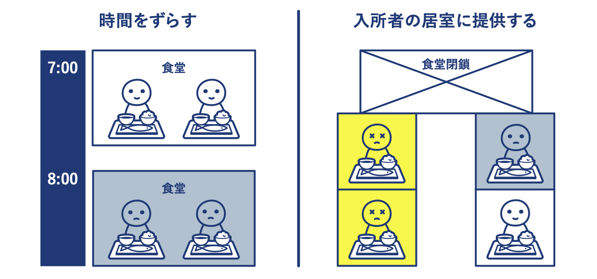

# Q
多床室の施設であり、隔離が難しい場合にどう対応したらよいですか？
(QA01-12)
​
# A
1. 個室が準備できない場合は、COVID-19 の疑いがあるまたは確認されている入所者をまとめることを検討してください。その際、以下の注意点があります。  
* COVID-19 が疑われる入所者は、COVID-19 が疑われる他の入所者とのみまとめられるべきであり、 COVID-19 が確認されている入所者と一緒にしてはいけません。
* 免疫が低下している入所者の隣で、感染疑いあるいは確定者をまとめてはいけません。

2. 部屋の入り口に、飛沫や接触に関する注意を促して、感染者・疑い患者の部屋を明示してください。  

3. COVID-19 の感染が疑われる、または確認された入居者の医療機器（医療専門職が使用する温度計、血圧計、パルスオキシメーターなど）は専用としてください。別の患者に使用する前には、機器を洗浄・消毒してください。

4. 他の入所者との個人用デバイス（モバイルデバイス、書籍、電子ガジェット）の共有は制限してください。

5. 入所者間の物理的な距離を確保するために食事をずらすか、できなければ、食堂を閉鎖し、 食事は入所者の居室で提供してください。

# 参考文献
参考(1)：WHO「長期療養型施設における COVID-19 感染予防と制御に関するガイダンス（暫定ガイダンス）」  
https://extranet.who.int/kobe_centre/sites/default/files/20200321_JA_LTC.pdf  
​  
​参考(2)：アメリカ疾病予防管理センター（CDC）  
「Aerosol and Surface Distribution of Severe Acute Respiratory Syndrome Coronavirus 2 in Hospital Wards, Wuhan, China, 2020」Zhen-Dong Guo ほか