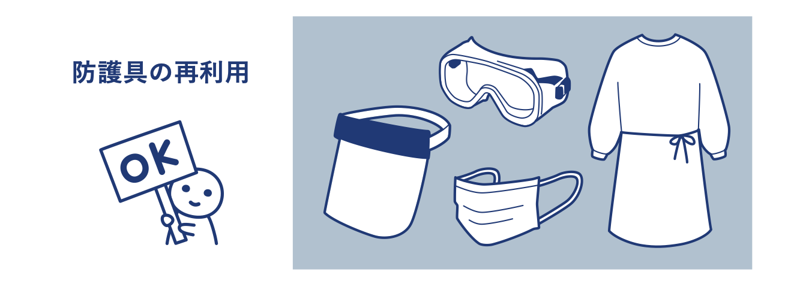
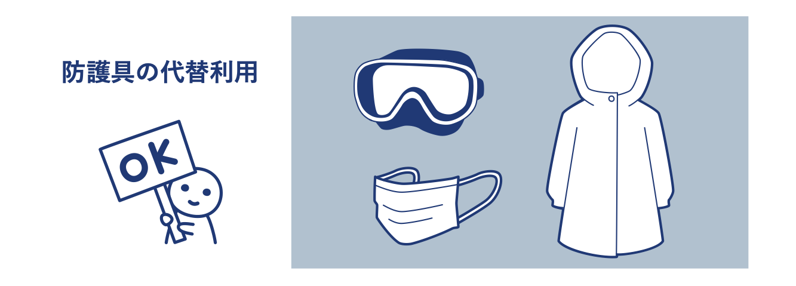
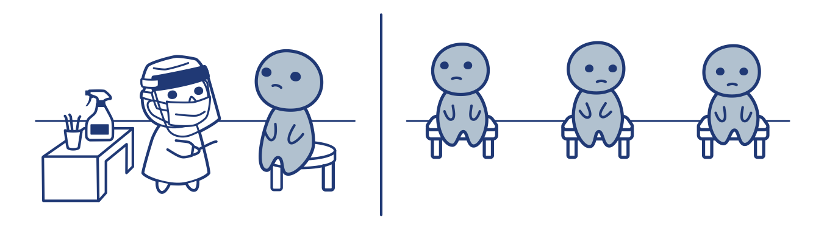
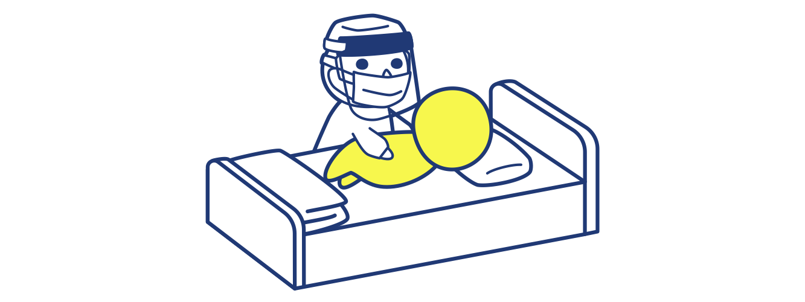

# Q
防護服・ガウン・ゴーグルの準備ができていない場合の感染者との接触はどうしたらよいですか？
(QA01-13)
​
# A
## 1. 使い捨てとされているサージカルマスク、長袖ガウン、ゴーグル及びフェイスシールドについては、再利用するなど個人防護具の例外的取扱いにより効率的に使用できます。  

### サージカルマスクについて
感染の可能性のある患者との密接な接触が避けられない場合など、使用機会の優先順位を設けてください。複数の患者を診察・検査等する場合においても、同一のサージカルマスクを継続して使用できます。
#### 注意点
1. 目に見えて汚れた場合や損傷した場合は、廃棄してください。
2. サージカルマスクを外す必要がある場合は、感染者のケアエリアから離れてください。
3. サージカルマスクを外す際は、マスクの外面を内側にして折りたたみ、接触感染を避けてください。

### ゴーグル及びフェイスシールドについて
複数の患者を診察する場合には、同一のゴーグルやフェイスシールドを継続して使用できます。​　
#### 注意点 
1. 目に見えて汚れた場合、洗浄及び消毒をしてください。
2. 一度外したら、再度装着する前に洗浄及び消毒をしてください。
3.  以下の場合はゴーグルやフェイスシールドを廃棄してください。
  * 損傷した場合
  * しっかりと固定できなくなった場合
  * 視界が妨げられ改善できない場合　など
4.  ゴーグルやフェイスシールドを外す必要がある場合、感染者のケアエリアから離れてください。

### 長袖ガウンについて
患者の体位交換や車いす移乗や、前腕や上腕が患者に触れるケアを行う時（長袖ガウン不足時は袖のないエプロン可）など、使用機会の優先順位を設けてください。

## 2. 医療用個人防護服が不足する場合、条件を満たす他のもので代替することも可能です。

### 長袖ガウンについて
体を覆うことができ、破棄できるもので代替可能です。撥水性があることが望ましいです。  
（例：カッパ）
​
### ゴーグル及びフェイスシールドについて
目を覆うことができるもので代替可能です。  
（例：シュノーケリングマスク）

## 備考
1. 原則、COVID-19 が疑われるまたは確定した入所者に対して日常的ケアを提供する際には、接触感染と飛沫感染の予防策を実践する必要があります。咳・痰などによる、いわゆるエアロゾルは4m飛散するという報告もあります。​
2. 個人防護具については、医療機関と個人でそれぞれ適切な利用例が示されています。高齢者施設や基礎疾患のある方の長期療養施設については、医療機関に準じた形になります。  
医療施設の場合、患者に直接ケアを実施する場合は医療用マスク、ガウン、手袋、目の保護具が必要です。清掃時には、医療用マスク、ガウン、頑丈な手袋、目の保護具、長靴や周囲を覆われた穴の開いていない作業靴が必要です。

# 参考文献
参考(1)：厚生労働省 新型コロナウイルス感染症対策推進本部「サージカルマスク、長袖ガウン、ゴーグル及びフェイスシールド、の例外的取扱いについて」  
https://www.mhlw.go.jp/content/000622132.pdf  
  
参考(2)：WHO「長期療養型施設における COVID-19 感染予防と制御に関するガイダンス（暫定ガイダンス）」  
https://extranet.who.int/kobe_centre/sites/default/files/20200321_JA_LTC.pdf  

「Infection prevention and control during health care when novel coronavirus (nCoV) infection is suspected」  
https://www.who.int/publications-detail/infection-prevention-and-control-during-health-care-when-novel-coronavirus-(ncov)-infection-is-suspected-20200125  
​  
参考(3)：アメリカ疾病予防管理センター（CDC）「Aerosol and Surface Distribution of Severe Acute Respiratory Syndrome Coronavirus 2 in Hospital Wards, Wuhan, China, 2020」Zhen-Dong Guo ほか  
https://wwwnc.cdc.gov/eid/article/26/7/20-0885_article  
  
参考(4)：WHO「新型コロナウイルス感染症（COVID-19）に対する個人防護具（PPE）の合理的な使用暫定ガイダンス」  
https://extranet.who.int/kobe_centre/sites/default/files/pdf/20200319_JA_PPE.pdf